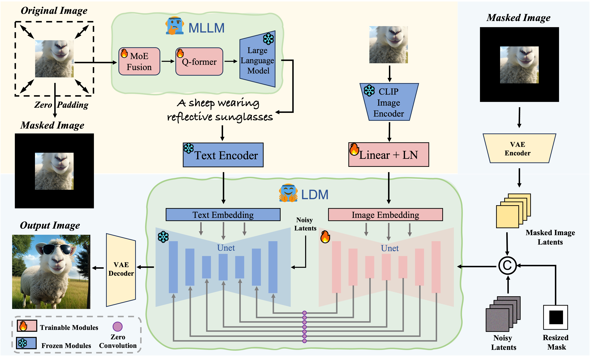

# ITGO
Official implementation of *ITGO: A General Framework for Text-Guided Image Outpainting.*

# Dependencies and Installation

```shell
# Clone the Repository
git clone https://github.com/nunu0214/ITGO.git

# Create Virtual Environment with Conda
conda create --name ITGO python=3.9
conda activate ITGO

# Install Dependencies
pip install -r requirements.txt
```
# Pretraied Model
Download our checkpoints [here](https://pan.baidu.com/s/1lLaGYQ04sTj8VKtPU3oa4w?pwd=s7ka).

You also need to download [clip-vit-base-patch32](https://huggingface.co/openai/clip-vit-base-patch32), [image_encoder](https://huggingface.co/h94/IP-Adapter/tree/main/models/image_encoder), [opt2.7b](https://huggingface.co/facebook/opt-2.7b/tree/main), and [realisticVisionV60B1_v51VAE](https://huggingface.co/krnl/realisticVisionV60B1_v51VAE/tree/main)

Finally, these pretrained models should be organized as follows:
```shell
pretrained_models
├── clip-vit-base-patch32
├── image_encoder
├── opt-2.7b
├── pretrained
└── realisticVisionV60B1_v51VAE
```
# ⚡ Quick Inference
```shell
python app.py --pretrained_model_path PRETRAINED_MODEL\
--base_model_path BASE_MODEL\
Usage:
  --pretrained_model_path path to pretrained model
  --base_model_path: can be realisticVisionV60B1_v51VAE
```
# Acknowledgements:
Our code is adapted from [PowerPaint](https://github.com/open-mmlab/PowerPaint), [BrushNet](https://github.com/TencentARC/BrushNet/tree/main) and [LAVIS](https://github.com/salesforce/LAVIS). Thanks for these authors for their valuable works and hope our model can promote the relevant research as well.
